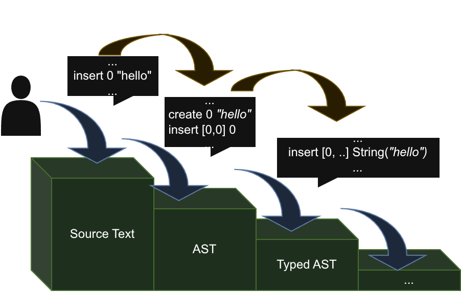
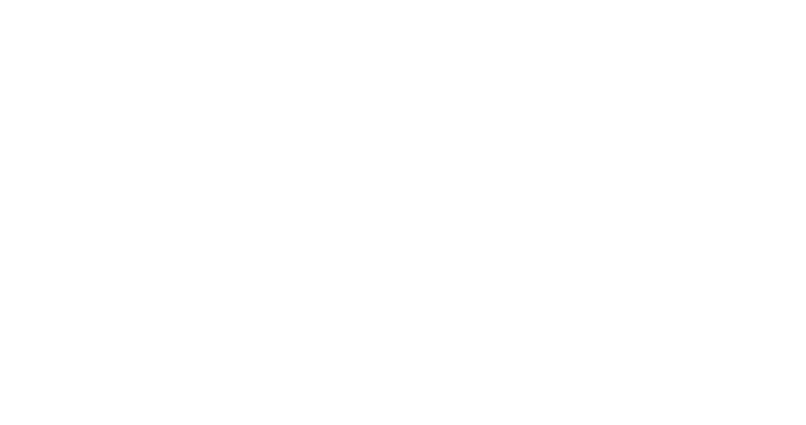

# Design as "terraced fields"

<figure>
  
  <figcaption><i>It really looks like terraced fields</i></figcaption>
</figure>

The layered structure of terraced fields facilitates irrigation flowing from high to low, reducing labor costs while efficiently utilizing water resources. A compiler is also a kind of terraced field, where each layer is called an **Intermediate Representation (IR)**, and the steps between layers are called **Pass** (though I'm not sure what its Chinese translation would be). The source of the water flow is the **update of source code**.

For Pass, we can modify the previous layer or attach information to serve as the next layer, or we can analyze the upper layer and construct the next layer. Since we're starting from the terraced field metaphor, the latter approach naturally takes precedence. This latter approach, due to its emphasis on immutability and inter-layer mapping, is also called a *functional* solution. This method not only makes projects modular but also, thanks to its unidirectional propagation nature, can form a **Pipeline** structure—by introducing concurrent strategies, information processing no longer blocks global execution but continuously outputs downward like a flowing stream.

*Pipeline is a common concept in everyday life. For example, on an automobile factory assembly line, specific tasks—such as installing engines, hoods, and wheels—are typically completed by independent workstations. Various workstations operate in parallel, each responsible for different stages of assembly. When a vehicle completes one task, it moves to the next station. Differences in task duration can be coordinated through "buffers" (reserving one or more vehicle spaces between stations) and/or "throttling" (temporarily stopping upstream operations) until downstream stations have capacity. —— Wikipedia*

Thus, whenever source code is updated, compilation doesn't wait for the previous code to finish compiling before processing current code. Instead, it continuously reads updates and outputs compiled code in a steady stream. In practice, however, compilers using this technique are rare. Most compilers typically apply this technique to the front-end only—code parsing, semantic analysis, macro expansion, etc.—while rarely using it in the back-end (optimization and machine code generation).

> It is believed that this is because back-end optimizations are difficult to program into a "terraced field" form, and the demand for such back-ends is limited, probably only for real-time previews in game development.

## Incrementalization

Given code updates, we naturally think of **Increment**. The natural way humans write source code is inherently incremental—sending a stream of edit instructions (insert, update, delete) to the source code modifies it. Code is modified from the top of our model, and each update triggered is like a small stream, triggering updates to each layer of IR from top to bottom. If we can make our streams:
1. Update only what needs updating at each layer
2. Not recalculate things that don't need updating

Then we achieve incrementalization in the compiler. Combined with the pipeline, compilation pressure and cost are distributed across each edit, greatly improving compilation speed.

## IR == Database

Databases have the capabilities of **modification** and **query**. Their add, delete, read, and update operations are all completed by **commands**, and a collection of multiple commands input in a time slice is called a **transaction**. IR itself can actually be viewed as a kind of database, where each IR may have completely different data structures and storage rules. Each layer of the compiler sends transactions in real-time to the next layer, and upon receiving a transaction, that layer modifies its local structure. Queries are the interface provided by each layer's IR, allowing queries about layer data details at any time. Just like a terraced field, there are small streams of water flowing between each layer, and each terrace has an incline, facilitating light incidence (queries).

Queries are relatively straightforward to understand. For example, the Abstract Syntax Tree (AST) layer provides interfaces to the outside world for querying node types and reporting errors, thus displaying highlights and code parsing errors. It also provides the next layer with the ability to query information about specified nodes (such as length, position in source code, file directory, etc.). But how should transactions work specifically?

We can view the database (IR) itself as an accumulation of transactions in a time series. As long as we ensure the first transaction has closure, it's like laying a foundation, and other transactions accumulate based on the indexes provided by the first transaction.

Next, we define transactions as collections of commands, where commands are primarily composed of Create, Insert, Delete, and Replace. It can be roughly written in the following form, where $I$ represents an index and $X$ represents the basic unit of stored objects.
\\[
\begin{split}
&\text{Transaction} \qquad T &&:= \varnothing \mid C, T \\\\
&\text{Command} \qquad C(I, X) &&:= \text{Create}(\mathbb{N}, X) \mid \text{Insert}(I, \mathbb{N}) \mid \text{Delete}(I) \mid \text{Replace}(I, \mathbb{N})
\end{split}
\\]

Here, we number each Create instruction in a transaction with a sequence number $\mathbb{N}$ from smallest to largest. Create doesn't modify the target data at all; it merely creates a form of "reference" to form the nodes we need. Insert/Delete/Replace all use the references formed by Create instructions. The benefits of this approach are: (1) the transaction itself is sufficiently closed, only using $I$ to indicate the location of the action, with other actions independent of context (the adjacent layers sending instructions); (2) when processing instructions, we can use stacks or tables to quickly create the required structures.

If a certain layer stores data in a generalized tree structure:
\\[
\begin{split}
V &:= a \mid b \mid c \mid ...\\\\
\text{Tree} &:= \text{Leaf}(V) \mid \text{Node}(\text{List}(\text{Tree}(V)))
\end{split}
\\]

Then $I$ will be a query path (Path) of the tree, for example $[0, 1, 2]$ represents the root node, under the first node, the second node. And $X$ will be the tree itself, either a leaf or a tree node. A certain transaction would look like this:

<figure>
  
  <figcaption><i>A simple transaction example</i></figcaption>
</figure>

Where $C_1 C_2 C_3$ mainly construct the tree to be inserted, and the exclamation mark plus number indicate references to previously created structures. When processing a transaction, we create a new cache table, store the created nodes in sequence order by their numbers, and only insert them into the database after obtaining the required structure.

The above is just a very simple example where the structure is a very basic tree. Of course, some IRs may involve more complex structures, such as graphs, where we need to adopt methods of inserting edges and inserting nodes to achieve incremental updates.

## Pass == Command Transformation

Traditional Passes often analyze all structures. After introducing commands as increments, Pass itself becomes a structure that only transforms the increments themselves, querying what's needed from the IR database.

From the Pass's perspective, each IR is more like a cache accumulated from increments, storing historical information needed by the Pass. From the IR's perspective, each Pass's command transformation organically connects each layer, making data flow efficient!

Well, after looking at the diagram below, you should roughly understand why I would describe such a compiler as a terraced field.