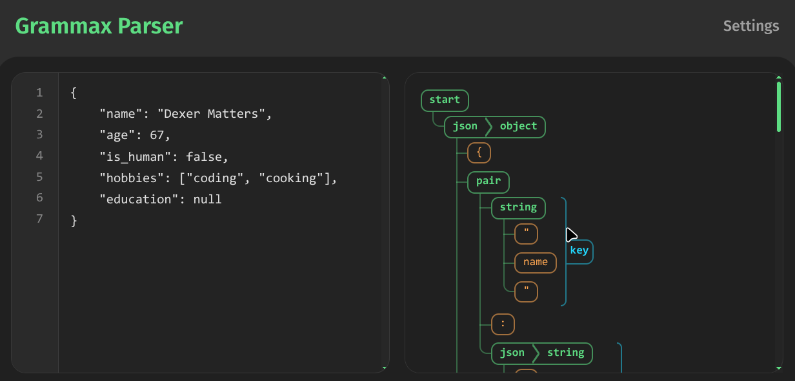

# A tour of Grammax

Grammax aims to provide a smooth and intuitive experience for both users and developers. It has a lot of modules helping you to build your own compiler frontend. Let's take our tour right now!

## Words

In Grammax, we have the module [grammax::words]() to help you define the lexical structure of your language. A matcher, which reads and scrutinizes the input, is like an iterator, but it does not mutate the input string. Instead, it may advance the given position where the matcher starts to read. The matcher ends with an optional value. It is either `None` for failed cases or `Some(n)` for successful ones, where `n` is the length of the matched string.

```rust
use grammax::parsec::words::*;

let input = "123456abc %%";
let mut pos = 0;
let numbers = NUMBER.matches(input, &mut pos);
let alphabets = ALPHABETS.matches(input, &mut pos);
let bad = "%%".matches(input, &mut pos);

assert_eq!(numbers, Some(6));
assert_eq!(pos, 6);

assert_eq!(alphabets, Some(3));
assert_eq!(pos, 9);

assert_eq!(bad, None);
assert_eq!(pos, 9);

// Use `token` to omit the leading spaces
let token_mods = token("%%").matches(input, &mut pos);
assert_eq!(token_mods, Some(3));
assert_eq!(pos, 12);
```

## Grammar

Now we can take a look at the module [grammax::grammar](), which provides a way to define the syntax of your language. We can use the macro `grammar!` to define a grammar using a macro rule similar to [PEG](https://en.wikipedia.org/wiki/Parsing_expression_grammar). The following codes define a simple grammar for arithmetic expressions. The `t` function is a helper to convert a matcher into a terminal rule. Macro rule `r!` is to reference a rule. `EndOfInput` is a special terminal rule that matches the end of the input string. And `drop(n)` is a helper to drop first n items of a rule reference.

```rust
use grammax::parsec::grammar::*;

let my_grammar = new_grammar! {
    // The rule to start parsing from
    start where
    // FORMAT: rule_name -> rule_body
    start -> r!(expr) + t(EndOfInput)
    expr -> r!(add) | r!(mul) | r!(num)
    add -> r!(expr) + t('+') + r!(expr).drop(1)
    mul -> r!(expr).drop(1) + t('*') + r!(expr).drop(2)
    num -> t(NUMBER) | t('(') + r!(expr) + t(')')
};

assert!(my_grammar.test("1+2*3"));
assert!(my_grammar.test("(1+2)*3"));
assert!(!my_grammar.test("1+2*"));

println!("{}", my_grammar.parse("1*(2+3)").format_ast());

/* Output:

start [width: 7]
   └─ expr [width: 7]
      └─ mul [width: 7]
         ├─ expr [width: 1]
         │  └─ num [width: 1]
         │     └─ 1 [width: 1]
         ├─ * [width: 1]
         └─ expr [width: 5]
            └─ num [width: 5]
               ├─ ( [width: 1]
               ├─ expr [width: 3]
               │  └─ add [width: 3]
               │     ├─ expr [width: 1]
               │     │  └─ num [width: 1]
               │     │     └─ 2 [width: 1]
               │     ├─ + [width: 1]
               │     └─ expr [width: 1]
               │        └─ num [width: 1]
               │           └─ 3 [width: 1]
               └─ ) [width: 1]
*/
```

## Always succeeds

Due to the design of error recovery, parsing always succeeds and returns a parse tree even for invalid inputs. You can check the error messages in the parse result to see if there are any errors.

```rust
let result = my_grammar.parse("1+2*");
println!("{}", result.format_messages());
/* Output:
error: missing token at 1:6
1 | 1*(2+3
          ^
  expected: ')'
*/
println!("{}", result.format_ast());
/* Output:
start [width: 6]
   └─ expr [width: 6]
      └─ mul [width: 6]
         ├─ expr [width: 1]
         │  └─ num [width: 1]
         │     └─ 1 [width: 1]
         ├─ * [width: 1]
         └─ expr [width: 4]
            └─ num [width: 4]
               ├─ ( [width: 1]
               ├─ expr [width: 3]
               │  └─ add [width: 3]
               │     ├─ expr [width: 1]
               │     │  └─ num [width: 1]
               │     │     └─ 2 [width: 1]
               │     ├─ + [width: 1]
               │     └─ expr [width: 1]
               │        └─ num [width: 1]
               │           └─ 3 [width: 1]
               └─ [MissingToken { expected: [5] }] [width: 0]
*/
```

## Let's parse JSON!

First, let's define the grammar for JSON. In the following code, we use the `tt` function which is a shorthand for `t(token(...))` to define terminal rules that omit leading spaces. We also use the `sep` function to define a rule for a list of items separated by a specific token.

The function `field` is useful to annotate a rule with a field name, which helps to make the parse tree more informative and easy to traverse.

```rust

let grammar = new_grammar!(
    start where
    start   -> r!(json) + tt(EndOfInput)
    json    -> r!(object) | r!(array) | r!(string) | r!(number) | r!(boolean) | r!(null)
    object  -> tt("{") + sep(r!(pair), tt(",")) + tt("}")
    pair    -> field("key", r!(string)) + tt(":") + field("value", r!(json))
    array   -> tt("[") + sep(r!(json), tt(",")) + tt("]")
    string  -> tt("\"") + t(STRING) + t("\"")
    number  -> tt(NUMBER)
    boolean -> tt("true") | tt("false")
    null    -> tt("null")
);
```

Rather than parsing texts through the method `parse` from the grammar, we can also build a parser from the grammar and then use the parser to parse texts.

```rust
let mut parser = Parser::new(grammar);

println!("Grammar:\n{}", parser.grammar.table);

let text = r#"{
    "name": "Dexer Matters",
    "age": 67,
    "is_human": false,
    "hobbies": ["coding", "cooking"],
    "education": null
}"#;
let result = parser.parse_text(text);

println!("AST:\n{}", result.format_ast());
println!("Messages:\n{}", result.format_messages());
```

## Let's use the command-line tool!
The command-line tool `gmx` provides a convenient way to pre-process, verify and test your grammar. You can even use it to interact with the parser in a REPL-like or web preview interface.

First, you need to write your grammar in a file better with the extension `.gmx` (or `.txt` anyway). The following is the content of `json.gmx` which defines the same JSON grammar as above.

```txt
start    -> json EOF
json     -> object | array | string | number | boolean | null
object   -> "{" pair{","}* "}"
pair     -> key:string ":" value:json
array    -> "[" json{","}* "]"
string   -> "\"" STRING "\""
number   -> NUMBER
boolean  -> "true" | "false"
null     -> "null"
```

Make sure you have command-line tool `gmx` installed following the instructions in the [installation chapter](./1-installation.md). Then you can run the following command to compile your grammar.

```bash
gmx compile json.gmx
```
This will generate a binary file `json.gmx.bin` in the same directory. You can use this binary file to test your grammar.

```bash
gmx test json.gmx.bin

----------------------------------
> Grammax CLI
> Press Ctrl + C to exit.
> Press Ctrl + S to submit.
----------------------------------
input: 
   1 | 42
----------------------------------
AST:
start [width: 2]
   └─ json [width: 2]
      └─ number [width: 2]
         └─ 42 [width: 2]

----------------------------------
input: 
   1 | 
```

This will start an interactive REPL where you can input texts to parse. You can also use the `--webui` option to start a web server and preview the parser in a web interface.

```bash
gmx test json.gmx.bin --webui
```

Then you can open your browser and go to `http://localhost:8080` to see the web interface. You can see the parse tree in the right panel incrementally as you type in the left panel.

