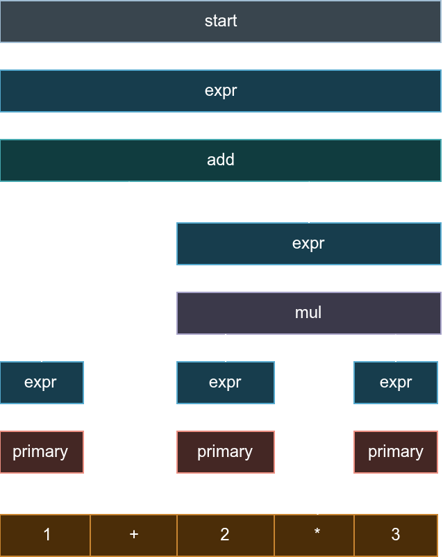

# Parse Tree

When you parse some text, the parser produces a **concrete syntax tree (CST)** — a tree structure that represents exactly what it found in your source code, without losing any details. Think of it as a detailed "parse tree" that faithfully captures every token and structure.

Grammax uses a red-green tree structure internally. Don't worry too much about this detail — it just means the parser is optimized to handle frequent updates. All you need to know is that you get a tree structure that you can explore and transform into your own custom data structures.

Let's look at a concrete example. Here's what the parse tree looks like for the expression `1 + 2 * 3`:

<center>
<figure>
  
  <figcaption>Parse tree structure for "1 + 2 * 3"</figcaption>
</figure>
</center>

This tree is built according to these grammar rules:

```ebnf
start   -> expr EOF
expr    -> add | sub | mul | div | primary
add     -> expr "+" expr/2
sub     -> expr "-" expr/2
mul     -> expr/2 "*" expr/4
div     -> expr/2 "/" expr/4
primary -> NUMBER | "(" expr ")"
```

In this tree:
- Each **node** is labeled with a grammar rule name (`start`, `expr`, `add`, etc.)
- The **edges** connect parent nodes to their children
- The **leaf nodes** are the actual tokens from your input (`1`, `+`, `2`, `*`, `3`)

The tree shows how the parser **classified** your input: the number `1` is recognized as a `primary`, which is part of an `expr`, which is part of an `add` expression, and so on.

One important feature: the tree is **lossless**. It keeps everything from the original text — no trimming, no simplification, no rearrangement. This means you can always reconstruct the original input from the tree, which is useful if you're building tools like formatters or refactoring systems.

## Node types

There are three types of nodes you'll encounter in a parse tree:

Rule nodes
  : These represent grammar rules. Examples: `start`, `expr`, `add`, `mul`. These are the "structural" nodes that show how your input is organized.

Token nodes
  : These are the actual pieces of text from your input. Examples: `1`, `+`, `2`, `*`, `3`. These are the "leaves" of the tree.

Error nodes
  : When the parser encounters something unexpected, it creates an error node with a [message](./4-1-basic.md#error-messages). For example, if you write `1 + a 3`, the parser won't know what to do with `a`, so it creates an error node there. This allows parsing to continue and recover from mistakes.

## Visualizing the tree

Once you've parsed some text, you can see what the tree looks like using the `format_ast()` method. It displays the tree in a nice text format with indentation and lines to show the structure.

Each node shows:
- The **rule name** (like `expr`, `add`, `mul`)
- The **width** — how many characters from the input text it covers

This makes it easy to understand how the parser structured your input! 

```
start [width: 9]
   └─ expr [width: 9]
      └─ add [width: 9]
         ├─ expr [width: 1]
         │  └─ primary [width: 1]
         │     └─ 1 [width: 1]
         ├─  + [width: 2]
         └─ expr [width: 6]
            └─ mul [width: 6]
               ├─ expr [width: 2]
               │  └─ primary [width: 2]
               │     └─  2 [width: 2]
               ├─  * [width: 2]
               └─ expr [width: 2]
                  └─ primary [width: 2]
                     └─  3 [width: 2]
```

The example above shows the pretty printed tree for the expression `1 + 2 * 3`. The root node is `start`, which has a child node `expr`, which has a child node `add`, and so on. The leaf nodes represent the tokens in the input text, such as `1`, `+`, `2`, `*`, and `3`. The width of each node indicates the span of the text it covers in the input.


## Navigating the tree

Once you understand the tree structure (from the pretty-printed output above), you can **navigate** through it using **node views**. This is helpful when you want to access a specific part of the tree.

For example, let's say you want to find the `mul` (multiplication) node in `1 + 2 * 3`. You can navigate down the tree like this:

```rust
let grammar = new_grammar_no_cache!(
    start where
    start -> r!(expr) + tt(EndOfInput)
    expr -> r!(add) | r!(mul) | r!(primary)
    add  -> r!(expr) + tt("+") + r!(expr).drop(1)
    mul  -> r!(expr).drop(1) + tt("*") + r!(expr).drop(2)
    primary -> tt(NUMBER) | tt("(") + r!(expr) + tt(")")
);

let text = "1 + 2 * 3";
let result = grammar.parse(text);

let view = result.view();  // Start from the root
let node_mul = view
    .first()   // Go to first child of `start` → this is `expr`
    .first()   // Go to first child of `expr` → this is `add`
    .last()    // Go to last child of `add` → this is the right `expr` (the `2 * 3` part)
    .first();  // Go to first child of that → this is `mul`!

println!("{}", node_mul);  // Print the mul node to see its structure

/* Output:
mul [width: 6]
   ├─ expr [width: 2]
   │  └─ primary [width: 2]
   │     └─ 1  [width: 2]
   ├─ +  [width: 2]
   └─ expr [width: 2]
      └─ primary [width: 2]
         └─ 2  [width: 2]
*/
```

As you can see, you navigate by chaining calls to `first()` and `last()`. You can print any node to see its structure and all its children!

## Building your own tree structure

The parse tree shows *exactly* what's in the input, but sometimes you want to transform it into a simpler structure that's easier to work with. This is where the **viewer** comes in!

With a viewer, you define how to convert the parse tree into your own custom data structure. For example, instead of keeping all the structural detail, you might create a simpler AST (Abstract Syntax Tree) like this:

```rust
#[derive(Debug)]
enum Expr {
    Number(u32),                    // Just a number
    Add(Box<Expr>, Box<Expr>),      // Two expressions added together
    Mul(Box<Expr>, Box<Expr>),      // Two expressions multiplied together
    Error,                           // Something went wrong
}
```

This is much simpler! It captures the essential meaning without all the parsing structure noise.

Now you can tell the parser how to build this `Expr` from the parse tree using a viewer:

```rust
let viewer = result
    .viewer()
    // Handle any errors in parsing
    .on_error(|_, _| ViewAction::Exact(Expr::Error))
    
    // For "expr" nodes, just pass through to the child
    .on_rule("expr", |_, _| ViewAction::<Expr>::Relay)
    
    // For "add" nodes, extract left and right sides and create an Add
    .on_rule("add", |ctx, view| {
        let lhs = view.first().view(ctx);  // First child is the left side
        let rhs = view.last().view(ctx);   // Last child is the right side
        ViewAction::Exact(Expr::Add(Box::new(lhs), Box::new(rhs)))
    })
    
    // For "mul" nodes, do the same for multiplication
    .on_rule("mul", |ctx, view| {
        let lhs = view.first().view(ctx);
        let rhs = view.last().view(ctx);
        ViewAction::Exact(Expr::Mul(Box::new(lhs), Box::new(rhs)))
    })
    
    // For "primary" nodes (leaf expressions), extract the number
    .on_rule("primary", |ctx, view| {
        // If it's a parenthesized expression, just return the inner expr
        if let Some(expr_view) = view.try_nth(1) {
            return ViewAction::Exact(expr_view.view(ctx));
        }
        // Otherwise, it's a number — parse it!
        let number = view.first().text_trimmed().parse::<u32>().unwrap();
        ViewAction::Exact(Expr::Number(number))
    });
```

Here's what's happening:

1. `result.viewer()` — start building a transformation ruleset
2. `.on_rule(name, handler)` — define what to do when you encounter a specific grammar rule
3. Inside each handler, you can:
   - Call `view.first()` and `view.last()` to access child nodes
   - Call `view.view(ctx)` on a child to transform it recursively
   - Return `ViewAction::Exact(your_value)` to produce a final value
   - Return `ViewAction::Relay` to pass through to the next handler without transforming

**Two key actions:**
- `ViewAction::Exact(value)` — "I've built the value, we're done here"
- `ViewAction::Relay` — "Nothing special here, check the child nodes"

Once you've defined all the rules, you can apply the viewer to transform the entire tree:

```rust
let ast: Expr = view.view(&viewer);
println!("{:}", ast); 

/* Output:
Add(Number(1), Mul(Number(2), Number(3)))
*/
```
